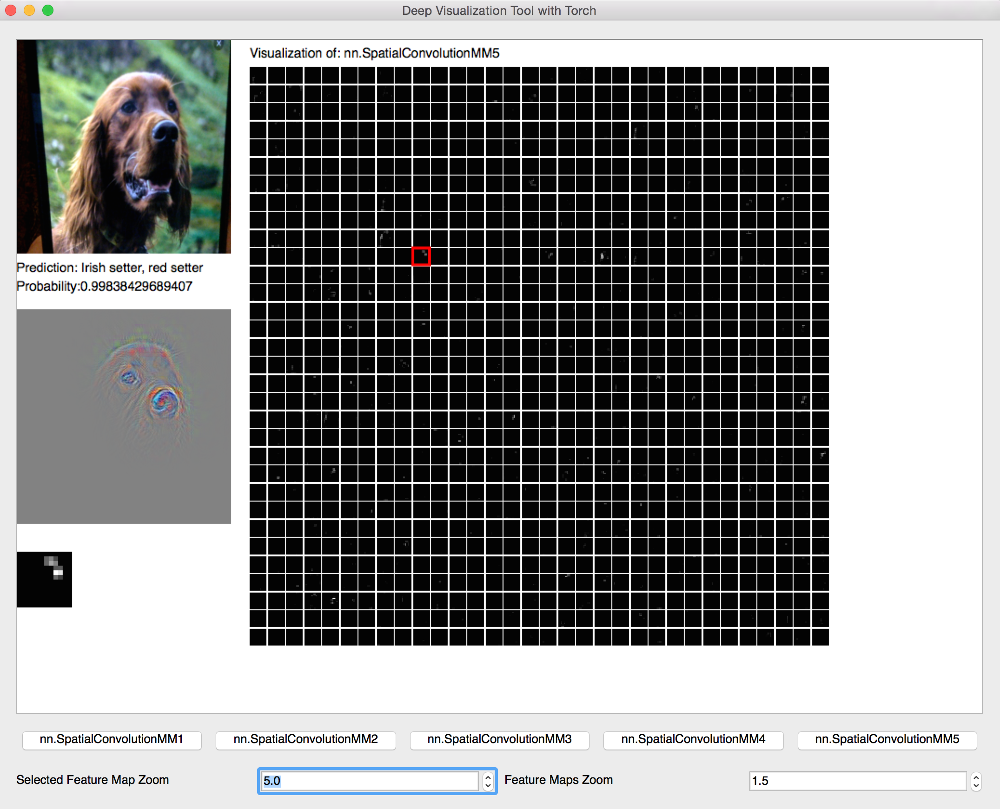

# torch-visbox

## Installation

To run this code you need to [install *Torch7*](http://torch.ch/docs/getting-started.html).

On *MacOS* you will need to install [*OpenCV*](http://opencv.org/) as well.

```bash
brew update
brew tap homebrew/science
brew install opencv
```

Finally, you need to install the [`camera`](https://github.com/clementfarabet/lua---camera) package.

```bash
luarocks install camera
```

## Running

```bash
qlua run.lua
```


